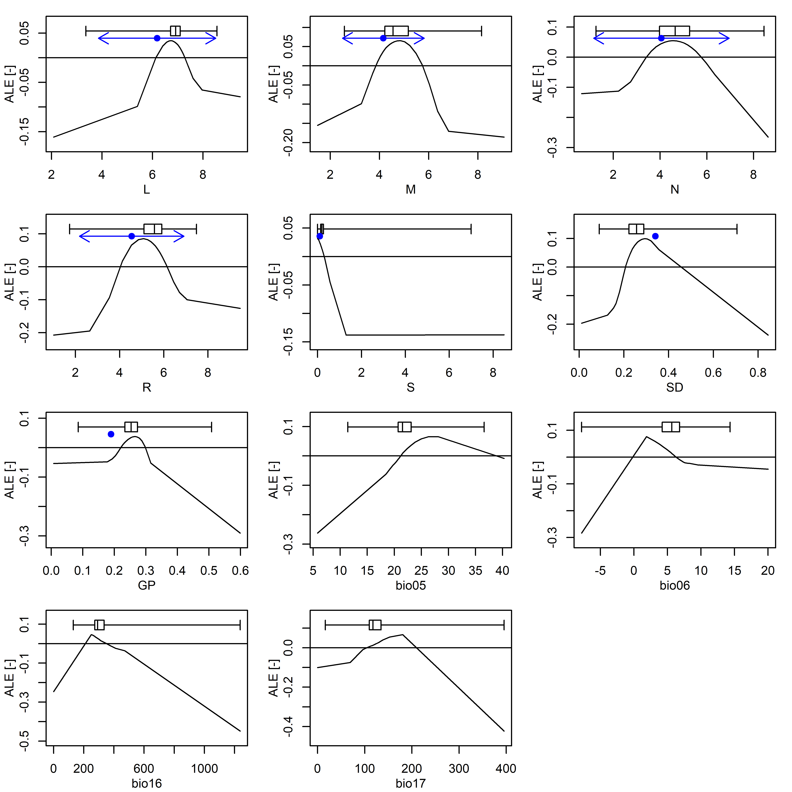

<!-- README.md is generated from README.Rmd. Please edit that file -->

# elements

<!-- badges: start -->

[]()
[](https://opensource.org/license/lgpl-3-0)
[]()
[](https://github.com/NERC-CEH/elements/actions/workflows/R-CMD-check.yaml)
<!-- badges: end -->

`elements` is a R package containing correlative, realised Ecological
Niche Models (ENMs) for the most prevalent vascular plants, bryophytes,
and terricolous lichens in the European Vegetation Archive (EVA) (Chytrý
et al., 2016).

<details>
<summary>
<h2 style="display:inline-block">
Methods
</h2>
</summary>

The ENMs adhere to Hutchinsonian conceptualisation of the ecological
niche as an n-dimensional hypervolume (Hutchinson, 1957). The
environmental variables forming the dimensions of each hypervolume
consist of:

- Seven unweighted, plot-mean Ecological Indicator Values (EIVs):
  - **M** - Soil Moisture<sup>1</sup>
  - **R** - Reaction<sup>1</sup>
  - **N** - Soil Nitrogen<sup>1</sup>
  - **L** - Light<sup>1</sup>
  - **GP** - Grazing Pressure<sup>2</sup>
  - **SD** - Soil Disturbance<sup>2</sup>
  - **S** - Salinity<sup>3</sup>
- Four bioclimatic variables:
  - **bio05** - Maximum temperature in the warmest month<sup>4</sup>
  - **bio06** - Minimum temperature in the coldest month<sup>4</sup>
  - **bio16** - Precipitation in the wettest quarter<sup>4</sup>
  - **bio17** - Precipitation in the driest quarter<sup>4</sup>

<p style="font-size: small !important">
<sup>1</sup>(Dengler et al., 2023), <sup>2</sup>(Midolo et al., 2023),
<sup>3</sup>(Tichy et al., 2023), <sup>4</sup>(Copernicus Climate Change
Service, 2021)
</p>

Support Vector Machine (SVM) models, which form a hyperplane between the
presence and absence hypervolumes, were trained and tested using using
the `mlr3` ecosystem of R packages (Lang et al., 2019). The raw `e1071`
(Meyer et al., 2024) SVM models are bundled in `elements`.

The code used to produce the models is available here
<https://github.com/NERC-CEH/elementsAnalysis>.

For more information please see Marshall et al (in prep).

</details>
<details>
<summary>
<h2 style="display:inline-block">
Installation
</h2>
</summary>

You can install the development version of elements from Github with:

``` r
if(!require("remotes")) install.packages("remotes")
remotes::install_github("NERC-CEH/elements")
```

Note: `elements` has two dependencies, `e1071` and `filehash`, which
must also be installed.

</details>
<details>
<summary>
<h2 style="display:inline-block">
Usage
</h2>
</summary>

### Retrieving models

Due to the total size of the ENMs currently included in `elements` the
ENMs are not exported in a .rda object. Instead they are made available
through a `filehash` (Peng, 2005) database, which provides access to the
ENMs without loading all models into memory. To access the ENMs a
connection to this database must be initialised using
`elements::startup`.

``` r
elements::startup()

model <- OccModels[["stellaria_graminea"]]
```

    #> 
    #> Call:
    #> svm(formula = Presence ~ L + M + N + R + S + SD + GP + bio05 + bio06 + 
    #>     bio16 + bio17, data = data, type = "C-classification", probability = TRUE)
    #> 
    #> 
    #> Parameters:
    #>    SVM-Type:  C-classification 
    #>  SVM-Kernel:  radial 
    #>        cost:  0.1 
    #> 
    #> Number of Support Vectors:  15039

### Using the models

The raw ENMs retrieved using the method above can be used as regular
`e1071` SVM model objects. Alternatively, the helper function
`elements::predict_occ_taxon` retrieves a model using the method above,
generates predictions, and formats the results as a data frame.

``` r
results <- elements::predict_occ_taxon(taxon = "stellaria_graminea", predictors = elements::ExampleData1, pa = "Present", limit = NULL, dp = 2, append_predictors = FALSE)
```

    #>   Present
    #> 1    0.00
    #> 2    0.40
    #> 3    0.26
    #> 4    0.74
    #> 5    0.06
    #> 6    0.02

An additional helper function `elements::predict_occ` can generate
predictions for multiple taxa, by either specifing the taxa to model in
the ‘taxa_codes’ argument, or by setting ‘taxa_codes’ to NULL and
including an additional column in the predictors data frame named
‘taxon_code’.

``` r
results <- elements::predict_occ(taxa_codes = NULL, predictors = elements::ExampleData2, pa = "Present", limit = NULL, dp = 2, append_predictors = FALSE)
```

    #>     Present         taxon_code
    #> 201    0.01 silene_flos-cuculi
    #> 202    0.01 silene_flos-cuculi
    #> 203    0.00 silene_flos-cuculi
    #> 204    0.01 silene_flos-cuculi
    #> 205    0.00 silene_flos-cuculi
    #> 206    0.97 silene_flos-cuculi

``` r
results <- elements::predict_occ(taxa_codes = c("stellaria_graminea", "silene_flos-cuculi"), predictors = elements::ExampleData1, pa = "Present", limit = NULL, dp = 2, append_predictors = FALSE)
```

    #>   Present         taxon_code
    #> 1    0.00 stellaria_graminea
    #> 2    0.40 stellaria_graminea
    #> 3    0.26 stellaria_graminea
    #> 4    0.74 stellaria_graminea
    #> 5    0.06 stellaria_graminea
    #> 6    0.02 stellaria_graminea

### Shutting down

At the end of the analyis run `elements::shutdown` to close the
connection to the filehash database.

``` r
elements::shutdown()
```

</details>
<details>
<summary>
<h2 style="display:inline-block">
Inspecting Models
</h2>
</summary>

Several datasets are available to examine the ENM model performance and
aid in model interpretation.

The performance measures can be retrieved from the
`elements::PerformanceMeasures` object; for example, below the balanced
accuracy from the random holdout sample and the model tuning
spatio-temporal cross-validation (Schratz et al., 2024) are displayed.

``` r
pm <- elements::PerformanceMeasures

pm_taxon <- pm[pm[["taxon_code"]] == "stellaria_graminea", c(1, 7, 8)]
```

    #>           taxon_code Holdout.BalancedAccuracy STCV.BalancedAccuracy
    #> 4 stellaria_graminea                0.8427822             0.8439437

The marginal effects of an ENM, in the form of Partial Dependency
Profile (PDP) and Accumulated Local Effect (ALE) plots (Molnar, 2018)
can also be viewed using the `elements::plot_me` function. By setting
the ‘presences’ argument is TRUE a box and whiskers plot showing the
distribution of presences is overlaid and by setting the ‘eivs’ argument
to TRUE a point and arrows showing the EIV and niche width values are
overlaid, where available in `elements::VariableData`.

``` r
elements::plot_me(taxon = "stellaria_graminea", 
                  me_type = "ale", 
                  free_y = TRUE, 
                  presences = TRUE,
                  eivs = TRUE,
                  vars = c("L", "M", "N", "R", "S", "SD", "GP", "bio05", "bio06", "bio16", "bio17"))
```



</details>
<details>
<summary>
<h2 style="display:inline-block">
References
</h2>
</summary>

Chytrý, M., Hennekens, S.M., Jiménez-Alfaro, B., Knollová, I., Dengler,
J., Jansen, F., Landucci, F., Schaminée, J.H.J., Aćić, S., Agrillo, E.,
Ambarlı, D., Angelini, P., Apostolova, I., Attorre, F., Berg, C.,
Bergmeier, E., Biurrun, I., Botta-Dukát, Z., Brisse, H., Campos, J.A.,
Carlón, L., Čarni, A., Casella, L., Csiky, J., Ćušterevska, R., Dajić
Stevanović, Z., Danihelka, J., De Bie, E., de Ruffray, P., De Sanctis,
M., Dickoré, W.B., Dimopoulos, P., Dubyna, D., Dziuba, T., Ejrnæs, R.,
Ermakov, N., Ewald, J., Fanelli, G., Fernández-González, F.,
FitzPatrick, Ú., Font, X., García-Mijangos, I., Gavilán, R.G., Golub,
V., Guarino, R., Haveman, R., Indreica, A., Işık Gürsoy, D., Jandt, U.,
Janssen, J.A.M., Jiroušek, M., Kącki, Z., Kavgacı, A., Kleikamp, M.,
Kolomiychuk, V., Krstivojević Ćuk, M., Krstonošić, D., Kuzemko, A.,
Lenoir, J., Lysenko, T., Marcenò, C., Martynenko, V., Michalcová, D.,
Moeslund, J.E., Onyshchenko, V., Pedashenko, H., Pérez-Haase, A.,
Peterka, T., Prokhorov, V., Rašomavičius, V., Rodríguez-Rojo, M.P.,
Rodwell, J.S., Rogova, T., Ruprecht, E., Rūsiņa, S., Seidler, G., Šibík,
J., Šilc, U., Škvorc, Ž., Sopotlieva, D., Stančić, Z., Svenning, J.-C.,
Swacha, G., Tsiripidis, I., Turtureanu, P.D., Uğurlu, E., Uogintas, D.,
Valachovič, M., Vashenyak, Y., Vassilev, K., Venanzoni, R., Virtanen,
R., Weekes, L., Willner, W., Wohlgemuth, T., Yamalov, S., 2016. European
Vegetation Archive (EVA): an integrated database of European vegetation
plots. Applied Vegetation Science 19, 173–180.
<https://doi.org/10.1111/avsc.12191>

Copernicus Climate Change Service, 2021. Downscaled bioclimatic
indicators for selected regions from 1950 to 2100 derived from climate
projections. <https://doi.org/10.24381/CDS.0AB27596>

Dengler, J., Jansen, F., Chusova, O., Hüllbusch, E., Nobis, M.P.,
Meerbeek, K.V., Axmanová, I., Bruun, H.H., Chytrý, M., Guarino, R.,
Karrer, G., Moeys, K., Raus, T., Steinbauer, M.J., Tichý, L., Tyler, T.,
Batsatsashvili, K., Bita-Nicolae, C., Didukh, Y., Diekmann, M.,
Englisch, T., Fernández-Pascual, E., Frank, D., Graf, U., Hájek, M.,
Jelaska, S.D., Jiménez-Alfaro, B., Julve, P., Nakhutsrishvili, G.,
Ozinga, W.A., Ruprecht, E.-K., Šilc, U., Theurillat, J.-P., Gillet, F.,
2023. Ecological Indicator Values for Europe (EIVE) 1.0. Vegetation
Classification and Survey 4, 7–29. <https://doi.org/10.3897/VCS.98324>

Hutchinson, G.E., 1957. Concluding Remarks. Cold Spring Harbor Symposia
on Quantitative Biology 22, 415–427.
<https://doi.org/10.1101/SQB.1957.022.01.039>

Lang, M., Binder, M., Richter, J., Schratz, P., Pfisterer, F., Coors,
S., Au, Q., Casalicchio, G., Kotthoff, L., Bischl, B., 2019. mlr3: A
modern object-oriented machine learning framework in R. Journal of Open
Source Software 4, 1903. <https://doi.org/10.21105/joss.01903>

Meyer, D., Dimitriadou, E., Hornik, K., Weingessel, A., Leisch, F.,
2024. e1071: Misc Functions of the Department of Statistics, Probability
Theory Group (Formerly: E1071), TU Wien.
<https://doi.org/10.32614/CRAN.package.e1071>

Midolo, G., Herben, T., Axmanová, I., Marcenò, C., Pätsch, R.,
Bruelheide, H., Karger, D.N., Aćić, S., Bergamini, A., Bergmeier, E.,
Biurrun, I., Bonari, G., Čarni, A., Chiarucci, A., De Sanctis, M.,
Demina, O., Dengler, J., Dziuba, T., Fanelli, G., Garbolino, E., Giusso
del Galdo, G., Goral, F., Güler, B., Hinojos-Mendoza, G., Jansen, F.,
Jiménez-Alfaro, B., Lengyel, A., Lenoir, J., Pérez-Haase, A., Pielech,
R., Prokhorov, V., Rašomavičius, V., Ruprecht, E., Rūsiņa, S., Šilc, U.,
Škvorc, Ž., Stančić, Z., Tatarenko, I., Chytrý, M., 2023. Disturbance
indicator values for European plants. Global Ecology and Biogeography
32, 24–34. <https://doi.org/10.1111/geb.13603>

Molnar, C., 2018. iml: An R package for Interpretable Machine Learning.
Journal of Open Source Software 3, 786.
<https://doi.org/10.21105/joss.00786>

Peng, R.D., 2005. filehash: Simple Key-Value Database.
<https://doi.org/10.32614/CRAN.package.filehash>

Schratz, P., Becker, M., Lang, M., Brenning, A., 2024. mlr3spatiotempcv:
Spatiotemporal Resampling Methods for Machine Learning in R. Journal of
Statistical Software 111, 1–36. <https://doi.org/10.18637/jss.v111.i07>

Tichý, L., Axmanová, I., Dengler, J., Guarino, R., Jansen, F., Midolo,
G., Nobis, M.P., Van Meerbeek, K., Aćić, S., Attorre, F., Bergmeier, E.,
Biurrun, I., Bonari, G., Bruelheide, H., Campos, J.A., Čarni, A.,
Chiarucci, A., Ćuk, M., Ćušterevska, R., Didukh, Y., Dítě, D., Dítě, Z.,
Dziuba, T., Fanelli, G., Fernández-Pascual, E., Garbolino, E., Gavilán,
R.G., Gégout, J.-C., Graf, U., Güler, B., Hájek, M., Hennekens, S.M.,
Jandt, U., Jašková, A., Jiménez-Alfaro, B., Julve, P., Kambach, S.,
Karger, D.N., Karrer, G., Kavgacı, A., Knollová, I., Kuzemko, A.,
Küzmič, F., Landucci, F., Lengyel, A., Lenoir, J., Marcenò, C.,
Moeslund, J.E., Novák, P., Pérez-Haase, A., Peterka, T., Pielech, R.,
Pignatti, A., Rašomavičius, V., Rūsiņa, S., Saatkamp, A., Šilc, U.,
Škvorc, Ž., Theurillat, J.-P., Wohlgemuth, T., Chytrý, M., 2023.
Ellenberg-type indicator values for European vascular plant species.
Journal of Vegetation Science 34, e13168.
<https://doi.org/10.1111/jvs.13168>

</details>
